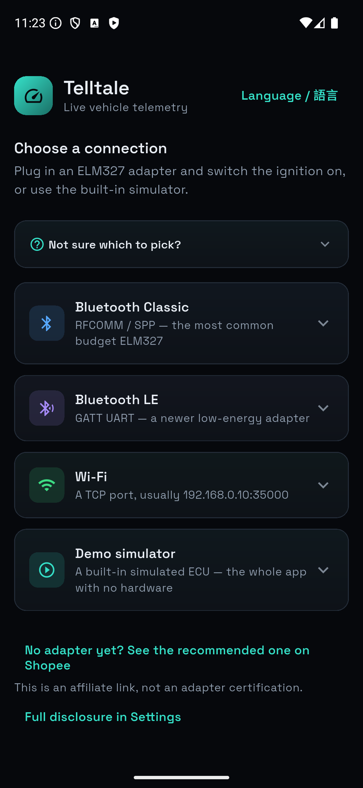
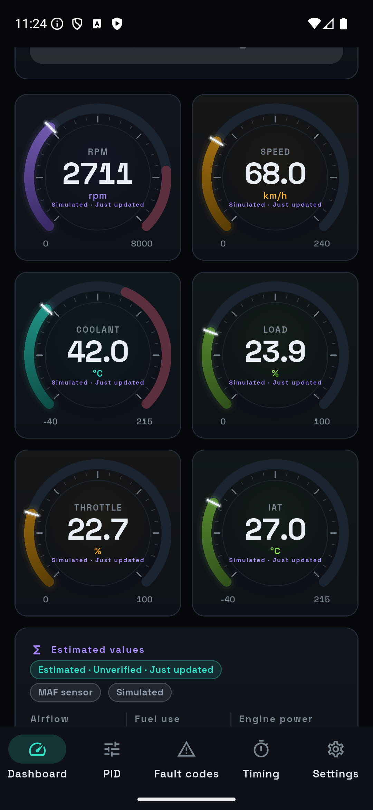
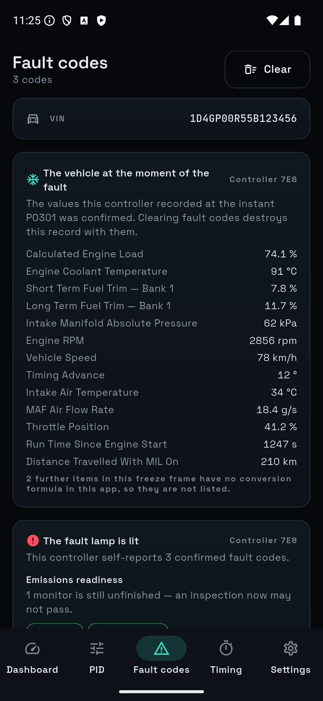
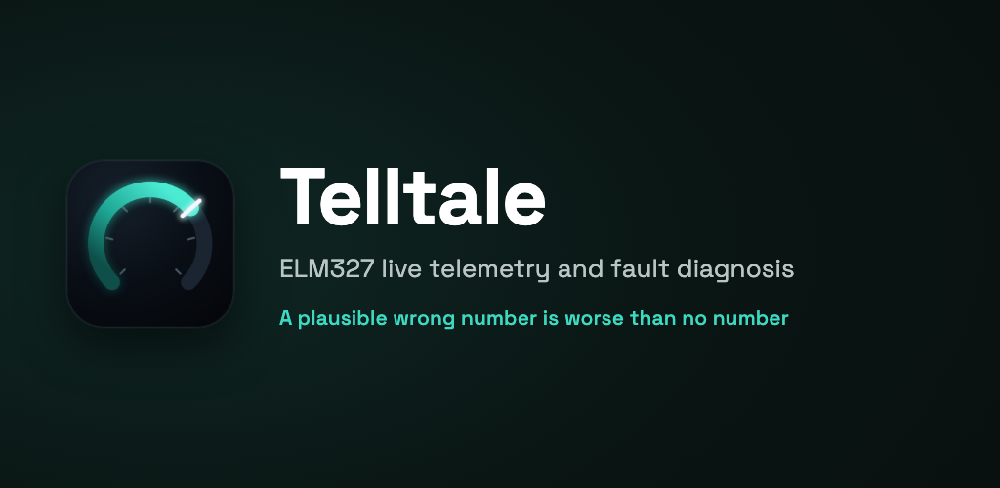

**English** | [繁體中文](README.zh-TW.md)

# Telltale

> **Development home:** https://github.com/ImL1s/telltale  
> Please open issues and pull requests there.  
> **Mirrors:** [Codeberg](https://codeberg.org/ImL1s/telltale) · [GitLab](https://gitlab.com/aa22396584/telltale)

> **While GitHub is temporarily restricted** (releases, CI badges, and raw assets
> may fail for anonymous visitors): use
> **[Google Play](https://play.google.com/store/apps/details?id=com.cbstudio.telltale)**
> for the preferred install;
> **[Codeberg](https://codeberg.org/ImL1s/telltale)** to browse source (primary during
> the outage) plus the **[GitLab mirror](https://gitlab.com/aa22396584/telltale)**;
> community APK **[v1.0.14 on Codeberg](https://codeberg.org/ImL1s/telltale/releases/tag/v1.0.14)**
> or **[GitLab Releases](https://gitlab.com/aa22396584/telltale/-/releases)**
> (GitHub Releases may be unreachable);
> [Obtainium](https://github.com/ImranR98/Obtainium) →
> `https://codeberg.org/ImL1s/telltale/releases`.
> Prefer opening issues on **GitHub** when you can; if GitHub is unreachable,
> open them temporarily on **[GitLab](https://gitlab.com/aa22396584/telltale/-/issues)**.
> This is downtime guidance only — GitHub remains the long-term development home.

[](https://github.com/ImL1s/telltale/actions/workflows/ci.yml)
[](https://github.com/ImL1s/telltale/releases)
[](https://play.google.com/store/apps/details?id=com.cbstudio.telltale)
[](LICENSE)

Telltale is an open-source Flutter app for real-time vehicle telemetry and OBD2
fault diagnosis through an ELM327-compatible adapter. It is designed to expose
uncertainty instead of turning malformed, incomplete, or conflicting replies
into confident-looking results.

> **A plausible wrong number is worse than no number.**

## Screenshots and vehicle demo

<p align="center">
  
  
  
</p>

[](https://youtu.be/Ugyg4RXhjVQ)

**[Watch the Toyota GT86 and BLE ELM327 demo on YouTube](https://youtu.be/Ugyg4RXhjVQ).**
It shows one real Samsung, adapter, and vehicle combination. The vehicle VIN is
redacted; the demo is evidence for that observed setup, not a universal
compatibility claim.

## Download and install

**Preferred:** **[Get the Play-signed build from Google Play](https://play.google.com/store/apps/details?id=com.cbstudio.telltale).**

**Paid on Google Play, with the same app features.** The Play edition does not
unlock extra telemetry or diagnostic features. It is the convenient choice for
Play-managed installation and updates, and purchasing it supports ongoing
development and maintenance. The community-signed APK below and builds from
source remain free to use.

**Community-signed APK** (same features as Play; release binaries are not stored
in the source tree). While GitHub is restricted, use these mirrors first:

1. **[Codeberg v1.0.14](https://codeberg.org/ImL1s/telltale/releases/tag/v1.0.14)**
   (primary during the outage) · [all Codeberg releases](https://codeberg.org/ImL1s/telltale/releases)
2. **[GitLab Releases](https://gitlab.com/aa22396584/telltale/-/releases)**
3. [GitHub Releases](https://github.com/ImL1s/telltale/releases) (may be
   unreachable for anonymous visitors right now)

Open the release and select its `.apk` asset. [Obtainium](https://github.com/ImranR98/Obtainium)
can track updates from `https://codeberg.org/ImL1s/telltale/releases`.

Community APKs use a **different signing key** from Google Play. They cannot
update, or be updated by, the Play build. Switching between them requires
uninstalling Telltale; export anything you need first because uninstalling
removes local app data.

## What it supports

- Bluetooth Classic using RFCOMM/SPP
- Bluetooth LE using a GATT UART service
- Wi-Fi adapters using a local TCP connection
- A built-in Demo ECU that needs no adapter or vehicle
- Live PID dashboards, fault codes, freeze frames, readiness, custom PIDs, and
  user-triggered diagnostic transcript export
- A searchable, integrity-checked schema-v3 powertrain-battery catalog with
  221 source-backed PHEV, HEV, BEV, MHEV, REEV, and FCEV profiles: 205
  metadata-only `researchOnly` entries, twelve installable cross-corroborated
  `community` entries (MG ZS EV Mk1, MG4 Electric, MG5 EV, BYD Atto 3,
  Hyundai Ioniq 5 and Ioniq 6, Kia EV6,
  Hyundai Kona Electric, Kia Niro EV, Kia Soul EV, Renault Zoe Ph1, VW e-up!
  gen2 — read-only BMS gauges, confirmed by at least two independent
  implementations, gated behind an install-time identity acknowledgement and
  a fresh per-connection vehicle confirmation), and four opt-in
  `experimental` entries (Lexus RX450hL, Toyota Prius TNGA, Kia EV9,
  Toyota bZ4X / Subaru Solterra e-TNGA). Three Mode 22 maps (Prius, EV9,
  e-TNGA) may be installed, labelled Experimental · Unverified on this
  vehicle; the Lexus Mode 21 map stays in the one-shot laboratory. The
  executable subset totals 157 bounded read-only signals; the powertrain
  split is BEV 89, FCEV 5, HEV 48, MHEV 7, PHEV 69, and REEV 3
- An integrity-checked, fully offline U.S. EPA Find-a-Car snapshot with 50,242
  exact configurations across 146 make labels and model years 1984–2027. Only
  source fields whose meaning matches the physics profile are applied; the app
  does not infer mass, torque, drag, VE, or transmission efficiency
- A fail-closed flow shared by every configured vehicle profile: any raw PID
  the vehicle answers remains visible, but profile-derived horsepower, torque,
  and fuel estimates stay hidden until the driver reviews and confirms the
  inputs for that connection; reconnecting invalidates the confirmation

The experimental battery laboratory is off by default. Its persistent Settings
switch only reveals the laboratory; it never trusts a vehicle. For every
connection and every attempt, the driver must choose one pinned Mode 21 or 22
command and give a new, short-lived acknowledgement for the selected year,
known identity evidence, unresolved fields, and a safely parked vehicle. The
app sends that command once: no identifier scan, batch, automatic retry,
installation, scheduled polling, persisted telemetry value, or dashboard use.
It accepts only the pinned responder, positive-response echo, exact payload
length, finite formula result, and bounded range.

The one-use consent is bound to the verified catalog hash, source revision,
profile, command, year, and connection generation. It expires after two
minutes; a five-second cooldown, three-attempt-per-command connection limit,
single-flight gate, structural-mismatch quarantine, and lifecycle/link boundary
invalidation keep it fail closed. The normal diagnostic transcript still
records the command and response as evidence; a synthetic rig or phone transport
test does not prove that a real vehicle exposes or correctly decodes that PID.
See [powertrain battery profiles](docs/powertrain-battery-profiles.md) for the
full counts, source limits, consent rules, licence, and validation boundary.

Android is the primary physically tested platform for device, UI, and BLE-rig
paths. iOS, macOS, Windows, and Linux have public compile gates and a runnable
Demo / Wi-Fi path in-tree; BLE is wired on every shipping host (Linux via
BlueZ/D-Bus). They do not yet carry equivalent physical-adapter or vehicle
evidence. Bluetooth Classic is offered in the UI on Android, macOS, Windows,
and Linux (`classicTransportAvailable`): Android is field-proven RFCOMM/SPP;
macOS uses IOBluetooth RFCOMM; Windows and Linux open Bluetooth SPP COM /
`/dev/rfcomm*` serial nodes. iOS permanently blocks third-party SPP and keeps
the Classic card grey. Desktop Classic is wired but still needs powered-adapter
field evidence before calling it mature. See
[platform support](docs/platform-support.md).

## Field-tested adapter

The maintainer has used Telltale over Bluetooth LE with a
**CARLZS LAB CL-OBDII-M25B** (`OBDBLE`, NCC `CCAH22LP5300T8`) on a Toyota
GT86. The same Samsung `SM-S9280` still holds a 418,028-byte recovered Telltale
session dated 2026-08-27.

**[View this adapter on Shopee](https://s.shopee.tw/3LQPiOY7uv)** — this is a
maintainer affiliate link. A qualifying purchase may pay the maintainer a
commission; you are free to search for or buy the same model elsewhere.
The same listing is in the app: Settings shows the full disclosure card;
Connect keeps a secondary text link below the transports.

This is one observed adapter/phone/vehicle combination, not certification or
a promise that every listing variant, phone, vehicle, PID, or firmware behaves
the same. Check the exact model and NCC number before buying. See the
[hardware compatibility notes](docs/hardware-compatibility.md) for the evidence
boundary.

## Build and test

Use the pinned Flutter 3.47.0 toolchain:

```bash
git clone https://github.com/ImL1s/telltale.git
cd telltale
FLUTTER="$HOME/fvm/versions/3.47.0/bin/flutter"
"$FLUTTER" pub get
"$FLUTTER" analyze
"$FLUTTER" test
"$FLUTTER" build apk --debug --flavor field
```

For a self-signed release build, follow
[the maintainer release guide](docs/maintainers/release.md). The `field` flavor
is the real-use application; the isolated `rig` flavor is test infrastructure.

## Verification boundary

The real Samsung-to-Mac BLE GATT radio path has passed with a simulated ELM327
peripheral. This proves physical BLE discovery, GATT connection, UART writes,
and notifications on that path. Separately, the field observation above proves
that one purchased CL-OBDII-M25B setup connected Telltale to one Toyota GT86
and left a substantial session record. The raw vehicle transcript is not
published because it can contain VIN and device identifiers; it was analysed
locally and only de-identified protocol shapes became regression fixtures. The
retained idle polling used CAN 11-bit/500 kbit/s and showed no `NO DATA`,
CAN/BUS error, timeout, or malformed reply. A large capacity-evicted middle
range remains, so the observation does **not** certify adapter firmware, PID
accuracy, DTC coverage, loaded-road behaviour, or general GT86 support.

Verification reports describe bounded evidence, not certification or a safety
guarantee. Start with [test evidence](docs/verification/test-evidence.md) and
[device verification](docs/verification/device-verification.md), then use the
[verification rig matrix](docs/verification/rig-matrix.md) for the reproducible
and identified commercial test layers.

## Repository layout

| Path | Purpose |
| --- | --- |
| `lib/` | App, state, UI, ELM327 protocol, and transports |
| `test/` | Unit, contract, parser, and widget tests |
| `integration_test/` | Device and isolated rig flows |
| `tool/` | Deterministic simulators and verification tooling |
| `android/`, `ios/`, `macos/` | Platform integration |
| `assets/` | Bundled fonts, icons, and official vehicle-data snapshots |

## Documentation

| Document | Purpose |
| --- | --- |
| [Documentation index](docs/README.md) | All user, evidence, and maintainer documents |
| [Field guide](docs/field-guide.zh-TW.md) | Safe real-car workflow and troubleshooting (zh-TW) |
| [Protocol deviations](docs/protocol-deviations.zh-TW.md) | Standards and hardware-behaviour notes (zh-TW) |
| [Vehicle data sources](docs/vehicle-data-sources.md) | Official snapshots, field semantics, hashes, and market limits |
| [Powertrain battery profiles](docs/powertrain-battery-profiles.md) | Catalog counts, install gates, evidence, provenance, and real-vehicle limits |
| [Changelog](CHANGELOG.md) | User-visible changes by version |
| [Contributing](CONTRIBUTING.md) | Development and pull-request requirements |

## Privacy and safe use

Telltale proactively uploads nothing. Local diagnostic exports can contain VIN,
device, adapter, and fault identifiers. You control explicit export and sharing;
operating-system backup may also copy private app data according to device
settings. Read [the repository policy](PRIVACY.md) or the
[published privacy policy](https://iml1s.github.io/telltale/privacy.html#en).

Use the app only while parked or as a passenger. Save diagnostic evidence before
clearing DTCs, and do not treat this app as a substitute for professional
inspection. See [SECURITY.md](SECURITY.md) for private vulnerability reporting
and [CODE_OF_CONDUCT.md](CODE_OF_CONDUCT.md) for community expectations.

---

## Support

If this project saved you some time, you can [buy me a coffee](https://buymeacoffee.com/iml1s).

## Licence and disclaimer

Contributions are welcome under the [contributor guide](CONTRIBUTING.md).
Telltale is licensed under [GPL-3.0](LICENSE). It is not affiliated with Ian
Hawkins' Torque or Torque Pro and is neither an official nor derivative version
of either product. The bundled official vehicle-data snapshots keep their own
[source and reuse notices](assets/vehicle_catalog/NOTICE.md). Powertrain-battery
sources retain separate
[third-party notices](THIRD_PARTY_NOTICES_POWERTRAIN_BATTERY.md). Use the app at
your own risk; no diagnostic result guarantees that a vehicle is safe to
operate.
