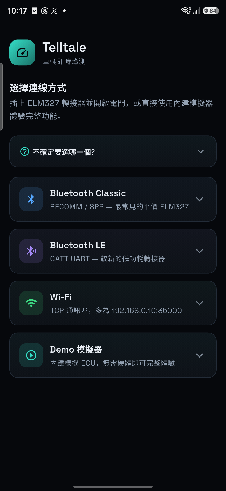
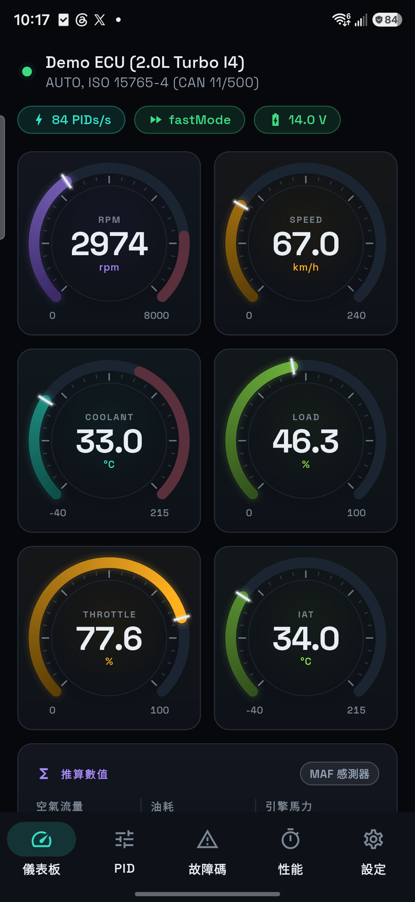
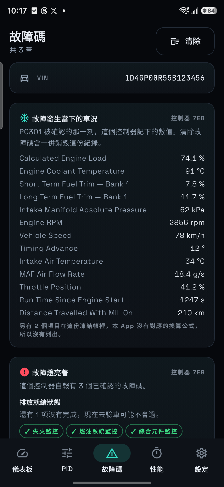
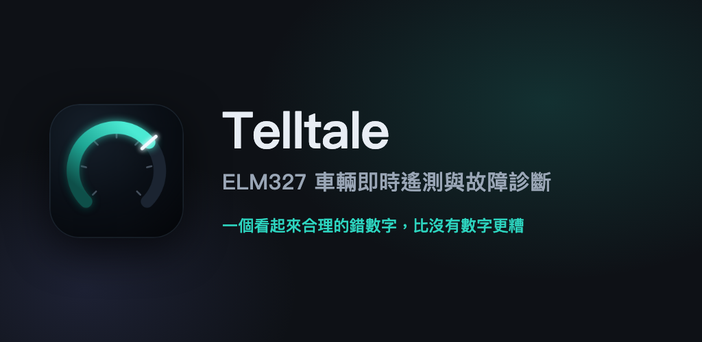

[English](README.md) | **繁體中文**

# Telltale

> **開發主頁：** https://github.com/ImL1s/telltale  
> Issues / PR 請開在 GitHub。  
> **鏡像備份：** [Codeberg](https://codeberg.org/ImL1s/telltale) · [GitLab](https://gitlab.com/aa22396584/telltale)

> **GitHub 暫時異常期間**（匿名訪客可能打不開 releases、CI 徽章、raw 資源）：
> 建議安裝請用
> **[Google Play](https://play.google.com/store/apps/details?id=com.cbstudio.telltale)**；
> 瀏覽原始碼請以 **[Codeberg](https://codeberg.org/ImL1s/telltale)** 為主，
> 另有 **[GitLab 鏡像](https://gitlab.com/aa22396584/telltale)**；
> 社群 APK 請下載
> **[Codeberg v1.0.14](https://codeberg.org/ImL1s/telltale/releases/tag/v1.0.14)**
> 或 **[GitLab Releases](https://gitlab.com/aa22396584/telltale/-/releases)**
> （GitHub Releases 可能暫時無法使用）；
> [Obtainium](https://github.com/ImranR98/Obtainium) 請指向
> `https://codeberg.org/ImL1s/telltale/releases`。
> Issues 仍請優先開在 **GitHub**；若 GitHub 打不開，可暫時改開
> **[GitLab Issues](https://gitlab.com/aa22396584/telltale/-/issues)**。
> 這只是暫時停機指引，長期開發主頁仍是 GitHub。

[](https://github.com/ImL1s/telltale/actions/workflows/ci.yml)
[](https://github.com/ImL1s/telltale/releases)
[](https://play.google.com/store/apps/details?id=com.cbstudio.telltale)
[](LICENSE)

Telltale 是開放原始碼 Flutter App，透過 ELM327 相容轉接器提供即時車輛遙測與
OBD2 故障診斷。它的設計原則是誠實呈現不確定性，不把格式錯誤、不完整或互相衝突
的回應包裝成看似可信的結果。

> **一個看起來合理的錯數字，比沒有數字更糟。**

## App 截圖與實車示範

<p align="center">
  
  
  
</p>

[](https://youtu.be/Ugyg4RXhjVQ)

**[在 YouTube 觀看 Toyota GT86 與 BLE ELM327 實車示範](https://youtu.be/Ugyg4RXhjVQ)。**
影片記錄一組 Samsung 手機、轉接器與車輛的實際連線，實車 VIN 已遮蔽；這是該組合
的實測證據，不代表所有手機、轉接器或車輛都相容。

## 下載與安裝

**建議優先：** **[前往 Google Play 取得 Play 簽章版](https://play.google.com/store/apps/details?id=com.cbstudio.telltale)。**

**Google Play 版付費，但 App 功能相同。** Play 版不會解鎖額外的遙測或診斷功能；
它提供由 Google Play 直接安裝與更新的便利，購買也會支持持續開發與維護。
下方的社群簽章 APK 與自行從原始碼建置仍可免費使用。

**社群簽章 APK**（功能與 Play 版相同；原始碼目錄不含 release 產物）。
GitHub 暫時異常期間，請優先使用以下鏡像：

1. **[Codeberg v1.0.14](https://codeberg.org/ImL1s/telltale/releases/tag/v1.0.14)**
   （異常期間首選）· [Codeberg 全部 releases](https://codeberg.org/ImL1s/telltale/releases)
2. **[GitLab Releases](https://gitlab.com/aa22396584/telltale/-/releases)**
3. [GitHub Releases](https://github.com/ImL1s/telltale/releases)（匿名訪客目前可能打不開）

打開該版本，選擇其中的 `.apk` 檔。[Obtainium](https://github.com/ImranR98/Obtainium)
可從 `https://codeberg.org/ImL1s/telltale/releases` 追蹤更新。

社群建置使用與 Google Play **不同的簽章金鑰**，無法更新 Play 版，也無法由
Play 版直接更新。兩者互換時必須先解除安裝；解除安裝會刪除 App 本機資料，
請先匯出需要保留的內容。

## 支援功能

- Bluetooth Classic（RFCOMM/SPP）
- Bluetooth LE（GATT UART service）
- Wi-Fi 轉接器的區域 TCP 連線
- 不需轉接器或車輛的內建 Demo ECU
- 即時 PID 儀表、故障碼、凍結幀、排放就緒、自訂 PID，以及由使用者主動匯出
  的診斷紀錄
- 可搜尋且經完整性檢查的 schema v3 大電池目錄，收錄 221 筆有來源的 PHEV、
  HEV、BEV、MHEV、REEV 與 FCEV 車型設定：205 筆是只有 metadata、完全沒有
  指令的 `researchOnly`；十二筆是**可安裝**的跨來源佐證 `community` 條目
  （MG ZS EV Mk1、MG4 Electric、MG5 EV、BYD Atto 3、Hyundai Ioniq 5／Ioniq 6、
  Kia EV6、Hyundai Kona Electric、Kia Niro EV、Kia Soul EV、Renault Zoe Ph1、
  VW e-up! gen2——唯讀 BMS 儀表，每條公式都經至少兩個獨立實作逐 byte 比對，
  安裝時需確認車輛身分，且每次連線都要重新確認車輛才會開始讀取）；四筆
  `experimental`（Lexus RX450hL、Toyota Prius TNGA、Kia EV9、Toyota bZ4X／
  Subaru Solterra e-TNGA）。其中三筆 Mode 22（Prius、EV9、e-TNGA）可安裝，
  並標成實驗 · 本車未驗證；Lexus 的 Mode 21 對照只能走單次實驗室。
  可執行子集合計 157 個有邊界的唯讀訊號；動力分布為 BEV 89、FCEV 5、
  HEV 48、MHEV 7、PHEV 69、REEV 3
- 內建經完整性檢查、完全離線的美國 EPA Find-a-Car 快照：50,242 筆精確配置、
  146 個 make／廠牌（製造商部門）標籤、年式 1984–2027。只套用語意能與公式設定逐欄對上的官方資料，
  不推測車重、扭力、風阻、VE 或傳動效率
- 每組車輛設定都套用安全確認流程：未確認車重、VE、風阻與驅動方式前，
  車輛有回覆的 OBD 實測值仍可顯示，但不會用通用預設值冒充實車的馬力、扭力或油耗；
  每次重新連線都會自動失效，避免把上一台車的設定套到下一台

大電池證據實驗室預設關閉。Settings 的持久開關只會顯示實驗入口，不代表信任
任何車輛。每次連線、每條指令、每次嘗試都必須重新選一條目錄內固定的 Mode 21
或 22 指令，並短效確認所選年式、已知身份證據、未證實欄位與車輛已安全停妥。
App 只送一次：不掃描 identifier、不批次、不自動重試、不安裝、不排程輪詢、不把
解碼值持久化，也不放入 dashboard。回覆必須逐項通過固定 responder、positive
response echo、exact payload length、有限公式結果與數值範圍檢查。

一次性同意會綁定已驗證的目錄雜湊、來源 revision、profile、指令、年式與連線
世代，兩分鐘後失效；另有五秒 cooldown、每條指令每次連線最多三次、single-flight、
結構錯誤隔離，以及背景／連線邊界失效。一般診斷紀錄仍會保存該次指令與回覆作為
證據；合成馬具或手機 transport 測試不等於實車 PID 或解碼正確性證明。完整數量、
來源限制、同意規則、授權與驗證邊界見
[大電池車型設定說明](docs/powertrain-battery-profiles.md)。

Android 是裝置、UI 與 BLE rig 路徑的主要實體測試平台。iOS、macOS、Windows
與 Linux 有公開編譯閘門與可執行的 Demo／Wi-Fi 路徑；BLE 在每個出貨主機都已
接上（Linux 走 BlueZ／D-Bus）。它們尚無同等的實體轉接器或實車證據。
Bluetooth Classic 在 UI 上對 Android、macOS、Windows、Linux 開放
（`classicTransportAvailable`）：Android 為已實機驗證的 RFCOMM/SPP；macOS 走
IOBluetooth RFCOMM；Windows／Linux 分別走藍牙 SPP COM 與 `/dev/rfcomm*`。
iOS 永久不開放第三方 SPP，Classic 卡片維持灰色。桌面 Classic 已接線，但在
有通電轉接器實機證據前仍不稱為成熟。見
[平台支援說明](docs/platform-support.md)。

## 已實車連線的轉接器

維護者已用 **CARLZS LAB CL-OBDII-M25B**（`OBDBLE`、NCC
`CCAH22LP5300T8`）透過 Bluetooth LE 讓 Telltale 連接 Toyota GT86。同一支
Samsung `SM-S9280` 目前仍保留一份日期為 2026-08-27、大小 418,028 bytes 的
Telltale 復原工作階段紀錄。

**[在蝦皮查看這支轉接器](https://s.shopee.tw/3LQPiOY7uv)** —— 這是維護者的推廣
分潤連結；符合條件的購買可能讓維護者取得佣金，你也可以自行搜尋或向其他通路購買
同型號。App 裡也有同一筆：設定頁是完整揭露卡，連線頁只在轉接器列表下方放次要
文字連結。

這只代表一組轉接器、手機與車輛的實際觀察，不是認證，也不保證同一賣場的所有
版本、所有手機、車輛、PID 或韌體行為相同。購買前請核對完整型號與 NCC 號碼；
證據邊界見[硬體相容性說明](docs/hardware-compatibility.md)。

## 建置與測試

使用固定的 Flutter 3.47.0 工具鏈：

```bash
git clone https://github.com/ImL1s/telltale.git
cd telltale
FLUTTER="$HOME/fvm/versions/3.47.0/bin/flutter"
"$FLUTTER" pub get
"$FLUTTER" analyze
"$FLUTTER" test
"$FLUTTER" build apk --debug --flavor field
```

若要建立自行簽章的 release，請依照
[維護者 release 指南](docs/maintainers/release.md)。`field` flavor 才是實際使用的
App；隔離的 `rig` flavor 是測試基礎設施。

## 驗證邊界

Samsung 實體手機到 Mac 的 BLE GATT 無線路徑，已搭配模擬 ELM327 peripheral 通過。
這證明該路徑上的實體 BLE 掃描、GATT 連線、UART 寫入與通知。上面的實車觀察則
另外證明一組購入的 CL-OBDII-M25B 曾讓 Telltale 連上 Toyota GT86，並留下足量的
工作階段紀錄。原始實車紀錄可能含 VIN 與裝置識別資訊，因此未公開，只在本機做過
去識別化分析。分析確認該次工作階段使用 CAN 11-bit/500 kbit/s，且保留的閒置輪詢
沒有 `NO DATA`、CAN/BUS error、逾時或格式錯誤；但中段紀錄因容量上限大量捨棄，
所以這項觀察**不代表**已認證轉接器韌體、PID 準確度、DTC 涵蓋率、道路負載行為
或所有 GT86。

驗證文件只描述有邊界的證據，不是認證或安全保證。請先閱讀
[測試證據](docs/verification/test-evidence.md)、
[裝置驗證](docs/verification/device-verification.md)，以及逐層列出可重現與商用測試設備
的[驗證馬具矩陣](docs/verification/rig-matrix.md)。

## 專案目錄

| 路徑 | 用途 |
| --- | --- |
| `lib/` | App、狀態、UI、ELM327 協定與 transports |
| `test/` | 單元、契約、parser 與 widget 測試 |
| `integration_test/` | 裝置與隔離 rig 流程 |
| `tool/` | 可重現的模擬器與驗證工具 |
| `android/`、`ios/`、`macos/` | 平台整合 |
| `assets/` | 內附字型、圖示與官方車輛資料快照 |

## 文件

| 文件 | 用途 |
| --- | --- |
| [文件索引](docs/README.md) | 所有使用、證據與維護者文件 |
| [實車指南](docs/field-guide.zh-TW.md) | 安全的實車流程與故障排除 |
| [協定差異](docs/protocol-deviations.zh-TW.md) | 標準查證與硬體行為註記 |
| [車輛資料來源](docs/vehicle-data-sources.md) | 官方快照、欄位語意、雜湊與市場邊界 |
| [大電池車型設定](docs/powertrain-battery-profiles.md) | 目錄數量、安裝閘門、證據、來源與實車限制 |
| [版本紀錄](CHANGELOG.md) | 各版本可見變更 |
| [貢獻指南](CONTRIBUTING.md) | 開發與 pull request 要求 |

## 隱私與安全使用

Telltale 不會主動上傳資料。本機診斷匯出可能含 VIN、裝置、轉接器與故障識別資訊；
匯出與分享由你主動控制，作業系統備份也可能依裝置設定複製 App 私有資料。請閱讀
[專案內政策](PRIVACY.md)或
[已發布的隱私權政策](https://iml1s.github.io/telltale/privacy.html#zh)。

請只在停妥時操作，或交由乘客操作。清除 DTC 前先保存診斷證據，也不要以本 App
取代專業檢查。安全漏洞請依 [SECURITY.md](SECURITY.md) 私下回報；社群互動規範見
[CODE_OF_CONDUCT.md](CODE_OF_CONDUCT.md)。

## 授權與聲明

歡迎依[貢獻指南](CONTRIBUTING.md)參與。Telltale 採
[GPL-3.0](LICENSE) 授權，與 Ian Hawkins 的 Torque / Torque Pro 無關，也不是其
官方或衍生版本。隨 App 提供的官方車輛資料快照另有
[來源與重用聲明](assets/vehicle_catalog/NOTICE.md)，大電池資料另有
[第三方來源聲明](THIRD_PARTY_NOTICES_POWERTRAIN_BATTERY.md)。請自行承擔使用風險；
任何診斷結果都不保證車輛可安全行駛。
